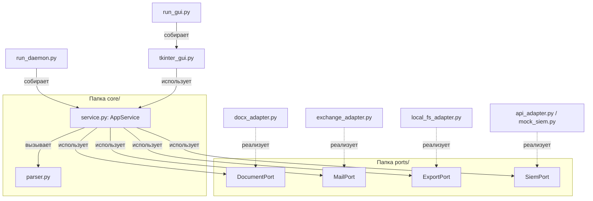

# INFRA: Схема сборки и внедрения зависимостей (Ports & Adapters)

Этот документ описывает, как устроены связи между компонентами приложения и как происходит сборка системы при старте.

---

## 1. Архитектурная схема взаимодействия

Компоненты взаимодействуют по принципу инверсии зависимостей (Dependency Inversion). Ядро содержит логику и порты (интерфейсы), а внешние адаптеры реализуют эти порты.



---

## 2. Спецификация Портов (Интерфейсов)

Все порты находятся в директории `ioc_analyzer/ports/` и объявляются как наследники `abc.ABC` с декораторами `@abc.abstractmethod`.

1. **`DocumentPort`**:
   - `extract_paragraphs(file_path: str) -> list[ParagraphData]`: Извлекает текст и XML-свойства абзацев (для детекции границ Госсопки).
2. **`MailPort`**:
   - `fetch_unread_emails() -> list[EmailRecord]`: Подключается к почтовому ящику, скачивает вложения во временную папку, возвращает метаданные писем.
   - `mark_as_read(mail_id: str) -> None`: Помечает обработанное письмо как прочитанное на сервере.
3. **`ExportPort`**:
   - `setup_directories(base_share_path: str) -> str`: Создает структуру папок для выгрузки.
   - `export_report(report_data: ReportData, output_dir: str) -> str`: Генерирует файлы `.xlsx` и `.csv`.
4. **`SiemPort`**:
   - `push_indicators(indicators: list[IOC]) -> bool`: Отправляет извлеченные индикаторы в SIEM.

---

## 3. Точка сборки (Dependency Injection)

Сборка приложения выполняется в стартовых файлах (`run_daemon.py` и `run_gui.py`). 

### Пример инициализации (run_daemon.py):
```python
import os
import json
from ioc_analyzer.core.service import AppService
from ioc_analyzer.adapters.document.docx_adapter import DocxAdapter
from ioc_analyzer.adapters.mail.exchange_adapter import ExchangeAdapter
from ioc_analyzer.adapters.export.local_fs_adapter import LocalFSAdapter
from ioc_analyzer.adapters.siem.api_adapter import SiemApiAdapter

def main():
    # 1. Загрузка конфигурации
    with open("config.json", "r", encoding="utf-8") as f:
        config = json.load(f)

    # 2. Инициализация адаптеров
    doc_adapter = DocxAdapter()
    mail_adapter = ExchangeAdapter(
        email=config["ews_email"],
        username=config.get("ews_username"),
        server=config.get("ews_server"),
        password_env_var=config.get("password_env_var", "EWS_PASSWORD"),
        outlook_folder=config.get("outlook_folder", ""),
        save_dir=config["save_dir"]
    )
    export_adapter = LocalFSAdapter(
        share_path=config["network_share_path"],
        preserve_files=config.get("preserve_existing_files", True)
    )
    siem_adapter = SiemApiAdapter(
        api_url=config["api_url"],
        api_key=config.get("api_key", "")
    )

    # 3. Внедрение зависимостей в бизнес-сервис ядра
    app_service = AppService(
        doc_reader=doc_adapter,
        mail_reader=mail_adapter,
        exporter=export_adapter,
        siem_client=siem_adapter,
        settings=config
    )

    # 4. Запуск логики
    app_service.process_pending_bulletins()
```
 такой подход позволяет легко заменить, например, `ExchangeAdapter` на `OutlookAdapter` ( win32com) или `SiemApiAdapter` на `MockSiemAdapter` для тестирования без изменения кода ядра.
