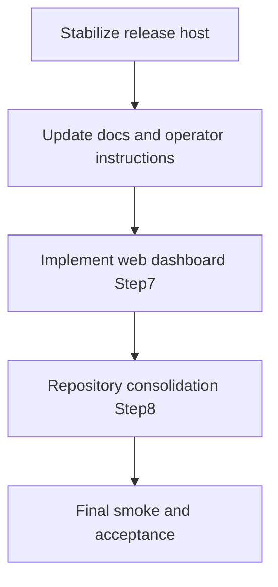

# Полный roadmap без FUTURE_TASKS

**Обзор:** закрыть текущую стабилизацию на рабочем хосте, затем выполнить шаги 7 и 8 из Phase 3 с контрольными проверками на каждом этапе.

## Вводные, которые реально применяются

- Рабочая папка для кода: `1_project/` (из корневого `agents.md` и `1_project/AGENTS.md`).
- Основные точки входа: `run_gui.py` и `run_daemon.py`.
- Для текущего плана исключаем backlog из `FUTURE_TASKS.md` по решению команды.

## Область этого плана

- **Включаем:** стабилизацию релиза на рабочем хосте + Шаг 7 + Шаг 8 из `PLAN_PHASE3.md`.
- **Исключаем:** SIEM/NAD future-задачи из `FUTURE_TASKS.md`.

## Последовательность работ

## Задачи

| ID | Задача | Статус |
|----|--------|--------|
| stabilize-smime-host | Довести и закрепить на рабочем хосте полный S/MIME → docx → report pipeline | pending |
| align-docs | Обновить instruction.md и README под текущую GUI/daemon логику | pending |
| implement-step7 | Сделать web-dashboard (Step 7) и run_web.py | pending |
| execute-step8 | Провести консолидацию репозитория и структуры (Step 8) | pending |
| final-acceptance | Выполнить финальный smoke/acceptance прогон всех entry points | pending |

---

### 1) Stabilize release on host (текущий блок)

- Закрепить рабочее поведение S/MIME в `ioc_analyzer/adapters/mail/exchange_adapter.py`:
  - decrypt через Windows Cert Store
  - извлечение docx из вложенных PKCS7/MIME
  - устойчивость к RFC2047 именам и пробелам в названиях
- Проверить server pipeline end-to-end в `ioc_analyzer/core/service.py`:
  - режим определяется по файлам
  - `IOC(...)` создаётся без `line_number`
  - отчёты попадают в `Отчет`, CSV в `Шаблоны IOC`
- Сформировать чеклист «принято на хосте»: 1 зашифрованное письмо с пачкой docx проходит полностью и помечается как read.

### 2) Doc and UX alignment

- Привести документацию в соответствие реальному GUI-флоу:
  - `instruction.md`
  - `README.md`
- Обновить шаги оператора:
  - в GUI выбирается родительская папка (не один xlsx)
  - автоопределение ФСТЭК/ГосСОПКА
  - в уведомлении открывается папка результата

### 3) Step 7 (web dashboard)

- Реализовать веб-адаптер по плану Phase 3:
  - `ioc_analyzer/adapters/web/__init__.py`
  - `ioc_analyzer/adapters/web/web_dashboard.py`
  - `run_web.py`
- Минимальный функционал первой версии:
  - health/status
  - последние логи демона
  - текущая конфигурация (read-only)

### 4) Step 8 (repo consolidation)

- Выполнить организационные шаги из `PLAN_PHASE3.md`:
  - выровнять ветки
  - перенести актуальную структуру проекта в целевой корень репозитория
  - убрать временные веточные директории после валидации
- Зафиксировать финальную структуру и единые команды запуска из корня.

### 5) Final acceptance gate

- Smoke-прогон из целевого корня:
  - `python -m pytest tests/`
  - `python run_gui.py`
  - `python run_daemon.py`
  - `python run_web.py`
- Критерий готовности: серверный и GUI сценарии проходят без ручных обходов, документация совпадает с фактическим поведением.
